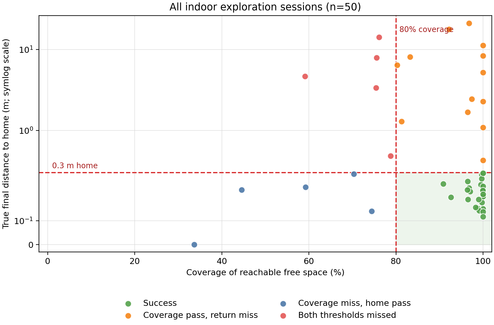
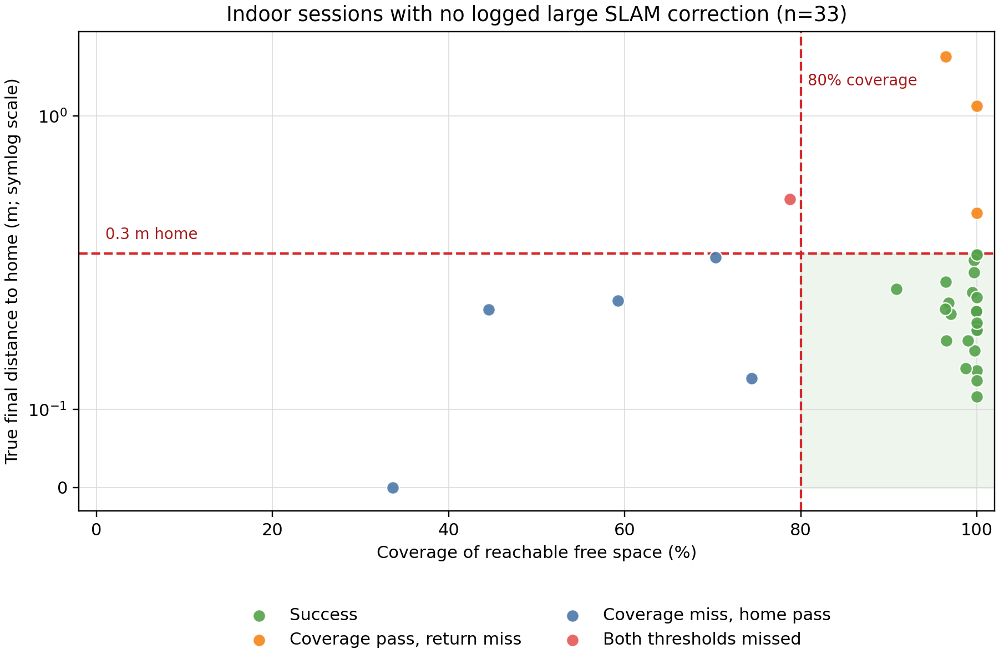

# Write-Up: Autonomous Explore-and-Return

## Approach

I implemented a map-driven frontier explorer on top of the provided SLAM and
Nav2 stack. The node runs a small state machine:

```text
WAITING_FOR_MAP -> EXPLORING -> RETURNING -> FINISHING -> DONE
```

During exploration it:

1. Treats a known-free occupancy-grid cell adjacent to an unknown cell as a
   frontier cell.
2. Rejects cells near obstacles, cells already effectively at the robot, and
   cells close to previously failed goals.
3. Groups remaining cells into 8-connected clusters and ignores very small
   clusters, which are commonly mapping noise.
4. Selects one reachable goal per cluster and scores clusters using distance,
   heading change, and estimated information gain. The heading term reduces
   unnecessary reversals; information gain is a bounded bonus rather than a
   reason to cross the map for a distant frontier.
5. Requests a Nav2 global path before committing to the navigation action.
   It rejects unavailable, zero-length, or narrow-path routes. A route whose
   detour is excessive is deferred once and then penalized, rather than being
   permanently discarded. This avoids repeatedly spending time on frontiers
   that look valid in the occupancy grid but are poor navigation targets.

Failed or unavailable frontier goals are blacklisted for the remainder of the
run, and an active frontier goal is cancelled if the immediately-ahead passage
narrows below the configured width. A large `map -> odom` correction from SLAM
invalidates an active *frontier* plan, so the node cancels that goal, lets the
costmaps settle for three seconds, and replans. A correction is treated as a
localization-instability signal, not proof that the map is corrupted. A
five-second action-response watchdog also prevents a lost `NavigateToPose`
request from leaving the state machine stuck.

If frontier clusters exist but none yields a usable goal, the robot tries a
directional recovery move before checking again. Exploration recovery tries up
to eight fixed directions, aims for a 0.8 m safe in-map endpoint, and shortens
the endpoint when the map boundary or an obstacle prevents the full move. Only
after the sweep and a 10-second no-frontier window does it consider exploration
complete.

For the return phase, home is never cached in the `map` frame. Home is the
`odom` origin, so the node transforms `(0, 0, 0)` from `odom` into `map`
immediately before every return attempt. This remains correct after SLAM
pose-graph corrections. Nav2 owns an active return-home goal and runs its own
recovery tree. If Nav2 reports that it cannot reach home, the explorer makes a
0.3 m directional recovery move, waits two seconds for SLAM and the costmaps
to update, and retries. On a successful arrival, the node calls
`/finish_exploration`.

## Design Decisions & Tradeoffs

The primary objective was dependable coverage with a reliable return, rather
than pursuing every last mapped boundary. In particular:

- A 0.5 m obstacle-clearance filter and a 0.55 m minimum passage width trade
  some potentially observable space for fewer collisions and stuck episodes.
- Frontiers must be at least 0.60 m away. This avoids Nav2 accepting a goal
  inside its 0.25 m tolerance without meaningful robot motion.
- The frontier score favors continuity of heading and only modestly rewards
  information gain. This reduces branch-to-branch oscillation and repeated
  travel through explored corridors, at the cost of occasionally delaying a
  large frontier behind the robot.
- A route whose Nav2 path exceeds 2.5x its straight-line distance is recorded
  as expensive and deferred once. Its measured detour becomes a score penalty,
  so cheaper frontiers are preferred without permanently excluding a reachable
  region.
- Failed goals are blacklisted within 0.8 m. This prevents retry loops but can
  discard a frontier that becomes practical after a later map update.

The explorer does not use an incidence-angle score. Its laser is used to build
a navigable SLAM map rather than to certify measurement quality at each stop,
so obstacle clearance, passage width, and route validity are the relevant
frontier-selection constraints. Incidence angle matters in the separate
viewpoint-planning challenge because accurate wall scanning is its objective:
grazing hits receive lower quality than near-normal hits before coverage is
counted.

The candidate costmap configuration was changed from the original 5 m × 5 m,
0.02 m-resolution local costmap to a 2 m × 2 m, 0.05 m-resolution rolling
local costmap. Both local and global costmaps changed from 0.1 m inflation
with a cost-scaling factor of 3.0 to 0.5 m inflation with a factor of 5.0.
This makes the robot more conservative around mapped obstacles and reduces
costmap computation, at the cost of treating more narrow space as unsuitable
for navigation.

The behavior tree retains Nav2's 1 Hz replanning and six top-level recovery
attempts, but changes the two context recovery nodes from one retry to zero.
Its recovery order changes from clear-costmaps → spin → wait → short backup
to clear-costmaps → 0.5 m backup → positive spin → negative spin. This favors
immediately creating clearance and changing heading over waiting in place.
The explorer's checks complement Nav2: Nav2 handles driving and local
recovery, while the explorer decides whether a proposed exploration target is
worth attempting.

## Conclusions

### Performance

The primary evaluation is the indoor batch: 10 sessions on each of five maps
(50 sessions total). This is intentionally the reported benchmark rather than
the unrestricted random-spawn batch. With a purely random spawn, the robot can
start outside the building, which no longer tests the intended *indoor*
explore-and-return task fairly. The indoor launcher selects reproducible
nonzero seeds whose initial lidar scan is enclosed by walls.

Success requires both at least 80% reachable-free-space coverage and a true
final home distance no greater than 0.30 m. The full batch achieved 27/50
(54.0%) successes. In the 33/50 sessions whose log contains no large
`map -> odom` correction, the same explorer achieved 24/33 (72.7%) successes,
with 91.8% mean coverage and 0.30 m mean final home distance. This is the
condition in which the explorer is most effective in the recorded evaluation.

| Evaluation group | Runs | Success | Coverage threshold | Return-home threshold | Mean coverage | Mean home distance |
|---|---:|---:|---:|---:|---:|---:|
| All indoor sessions | 50 | 27/50 (54.0%) | 40/50 (80.0%) | 32/50 (64.0%) | 90.7% | 2.49 m |
| No logged large SLAM correction | 33 | 24/33 (72.7%) | 27/33 (81.8%) | 29/33 (87.9%) | 91.8% | 0.30 m |

Each marker in the following figures is one completed indoor session. The
green lower-right quadrant is the success region; the vertical and horizontal
dashed lines are the coverage and return-home requirements. The symmetric-log
home-distance axis preserves both exact returns and multi-metre misses.





To recreate both figures and the accompanying CSV/Markdown summary from the
saved indoor reports, run `python3 summarize_indoor_batch.py` from the
repository root.

The second figure is not a claim that the excluded maps are definitely
corrupted. It only filters runs whose `console.log` reports a large SLAM map
correction, an observable localization-instability signal. The marked drop in
return-home performance in the all-session plot makes SLAM/pose consistency the
dominant observed limitation, rather than coverage alone.

| Map | Runs | Success | Mean coverage | Mean home distance | Mean simulated time |
|---:|---:|---:|---:|---:|---:|
| 1 | 10 | 5/10 | 99.2% | 2.87 m | 619.7 s |
| 2 | 10 | 2/10 | 81.6% | 6.02 m | 1193.8 s |
| 3 | 10 | 4/10 | 89.3% | 3.04 m | 972.0 s |
| 4 | 10 | 9/10 | 98.2% | 0.36 m | 369.3 s |
| 5 | 10 | 7/10 | 85.2% | 0.17 m | 765.2 s |

For a reproducible evaluation, include one row per run with the following
data: map ID/path, run ID (the result-directory timestamp), requested and
reported seed, code commit, explorer/SLAM/Nav2 configuration, time scale,
`coverage_fraction`, `distance_to_home_m`, `elapsed_time_s`,
`collision_count`, `timed_out`, `success`, and a map-integrity classification
(`usable`, `corrupted`, or `uncertain`) supported by the saved `map.yaml`/
`map.pgm` and logs. Summarize those rows per map and across several nonzero
seeds, reporting both all-run results and the usable-map subset; do not omit
corrupted-map runs from the overall success rate.

Run the 10-trial-per-map indoor evaluation in Docker from the repository root:

```bash
docker compose -f explore_and_return/docker/docker-compose.yml run --rm challenge \
  bash -lc 'cd /challenge && ./run_explore_and_return_evaluation.sh 10'
```

To run the unrestricted random-spawn baseline instead:

```bash
docker compose -f explore_and_return/docker/docker-compose.yml run --rm challenge \
  bash -lc 'cd /challenge && SPAWN_MODE=random ./run_explore_and_return_evaluation.sh 10'
```

For a smaller or tuned batch, pass environment variables before the script;
for example, this runs five trials only on Maps 1 and 3 at a 1,800-second
simulated-time limit:

```bash
docker compose -f explore_and_return/docker/docker-compose.yml run --rm challenge \
  bash -lc 'cd /challenge && MAP_IDS="1 3" TIME_LIMIT_S=1800 ./run_explore_and_return_evaluation.sh 5'
```

The batch evaluator is my contribution. By default it selects reproducible
nonzero seeds whose initial location is tightly enclosed by walls in a
simulated 360° lidar scan of `room.pgm`; it does not need a pre-made spawn
mask. This keeps the indoor evaluation set separate at
`results/explore_and_return/batch_random_indoor/<map>/trial_XX/`. To retain
an unrestricted baseline, set `SPAWN_MODE=random`; those random-spawn results
are written to `results/explore_and_return/batch_random/<map>/trial_XX/`, but
are not included in the indoor comparison because a random spawn can be
outside the building.

Each completed trial includes the simulator report, saved map, and console
log. The launcher is resumable: it skips a trial with an existing `report.yaml`
and preserves an incomplete trial folder for inspection rather than
overwriting it.

### What I'd Do With More Time

- Improve stuck recovery beyond the current hard-coded sweep, using the map,
  progress history, and local costmap to choose a safe escape direction.
- Detect long or narrow corridors while navigating and adjust goal selection,
  clearance, and recovery behavior before the robot becomes trapped.
- Add explicit coverage and return-margin budgeting, allowing the node to
  leave low-value frontier remnants when the estimated return cost is high.

### Known Limitations / Where I Expect This to Break

- Occupancy-grid frontiers are sensitive to incomplete or noisy SLAM maps;
  filtering helps, but can remove narrow legitimate entrances.
- The distance-transform and cross-section tests use the current map rather
  than the exact robot footprint and future local-costmap state. A route can
  still become blocked after it is accepted.
- The 10-second no-frontier timeout may stop too early if SLAM publishes a
  delayed map update, while a longer timeout wastes simulated time in a truly
  complete map.
- Recovery moves are open-loop Nav2 goals in fixed relative directions. They
  are practical for escaping local dead ends but are not a general local
  exploration planner.
- Exact repeatability is not expected for evaluation runs with random spawn
  seed `0`; fixed nonzero seeds make the simulator spawn reproducible, though
  asynchronous SLAM and navigation timing can still introduce small variation.

## Modified Files or Packages

- `candidate_explorer/candidate_explorer/explorer_node.py`: frontier
  detection, target scoring, path validation, recovery, map-correction
  handling, and return-home logic.
- `candidate_explorer/config/costmap_params.yaml`: candidate costmap overlay
  with laser obstacle layers and inflation settings.
- `candidate_explorer/config/navigate_to_pose.xml`: editable Nav2 replanning
  and recovery behavior tree.
