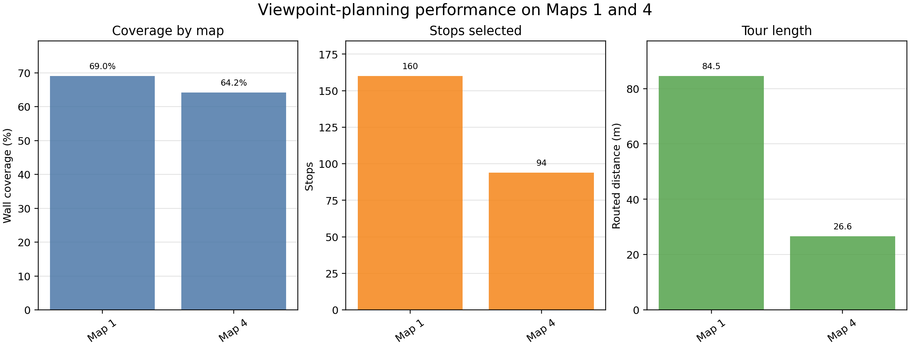

# Write-Up: Minimum-Stop Viewpoint Planning

## Approach

This task starts with a known occupancy grid, so I treat it as an offline
coverage-and-routing problem rather than an exploration problem. The planner:

1. Builds the footprint-clear traversable mask for the 0.2 m-radius robot and
   keeps the enclosed connected room component with the strongest wall
   contact. This avoids proposing stops in exterior free space.
2. Samples valid candidate stops on a deterministic 0.05 m grid. For every
   candidate, it simulates the supplied 360-degree laser and retains wall
   cells that meet the required scan-quality threshold. The quality model also
   penalizes grazing incidence angles: a nearly parallel laser hit is less
   reliable because a small range or pose error can shift the apparent wall
   intersection much more than for a near-normal hit.
3. Solves a two-stage binary set-cover model. The first mixed-integer program
   maximizes the number of wall cells covered by the candidate set; the second
   minimizes stop count while preserving that maximum coverage. If the solver
   cannot return a solution, a deterministic greedy coverage fallback is used.
4. Orders the selected stops with nearest-neighbor routing on true
   footprint-clear grid paths, then improves that order using 2-opt. It tries
   two deterministic start stops and keeps the shorter routed tour.

The selected stops and their order are deterministic: no random sampling or
random solver seed is used.

The map parser uses `free_thresh` and `occupied_thresh` from each `room.yaml`
independently. A pixel at or below `free_thresh` is free, a pixel at or above
`occupied_thresh` is a wall, and a value between them is unknown. This avoids
the original loose interpretation that treated every non-occupied pixel as
free, mixing ROS gray unknown cells with valid floor space and potentially
creating invalid candidate stops. Maps 1 and 4 are black-and-white, so this
classification does not change their result, but it matters for partially
known ROS maps containing unknown gray cells.

## Design Decisions & Tradeoffs

I optimized first for wall coverage at the scorer's quality threshold, then
for fewer stops. Tour length is optimized only after coverage and stop
selection, so it cannot trade away coverage. This matches the scoring priority
but can leave a longer route than a joint coverage-and-tour optimizer would.

A 0.05 m candidate grid gives the set-cover stage many good viewpoints near
walls and occlusions, improving the chance of coverage. Its cost is high
planning time and a large mixed-integer program on the larger maps. The
visibility calculation also includes the supplied range and incidence-quality
model, so a geometrically visible wall cell is counted only if the simulated
measurement is accurate enough.

## Conclusions

### Performance

The current planner was evaluated once on Maps 1 and 4 with the fixed 8 m
range, 0.5 minimum-quality, and 0.2 m robot-radius settings. Every output
below is generated from the canonical reports in
`results/viewpoint_planning/<map>/`; the reported tour lengths are routed
through footprint-clear free space, not straight-line distances.

The selected coverage is near the maximum available from filling the room with
every valid 0.05 m candidate-grid stop. Such a filled plan can cover only the
union of cells visible from that same candidate set; the first optimization
stage explicitly maximizes this union, then the second preserves its attained
coverage while minimizing stop count. The solver has a time limit, so this is
a practical candidate-grid maximum rather than a proof of the continuous-space
optimum.

| Map | Coverage | Stops | Routed tour length | Planning time | Invalid stops |
|---:|---:|---:|---:|---:|---:|
| 1 | 69.0% | 160 | 84.54 m | 361.32 s | 0 |
| 4 | 64.2% | 94 | 26.62 m | 55.85 s | 0 |

Across the two maps, wall-cell-weighted coverage was 67.5% (10,633 of 15,752
observable wall cells), with no invalid stops. Map 1 needs more stops and a
longer route because its room geometry is larger and more segmented than Map
4.

Run `MAP_IDS="1 4" ./run_viewpoint_planning_evaluation.sh` from the repository
root to recreate these two reports, the summary table, and the figure. The
Docker image must be built first with
`docker build -t viewpoint-planning viewpoint_planning`.

### What I'd Do With More Time

- Prune dominated candidates and adapt candidate spacing to reduce planning
  time on large maps without sacrificing coverage.
- Optimize stop selection and tour order jointly, instead of treating routing
  as a post-processing step.
- Add a principled stopping rule for wall cells that cannot be covered at the
  required quality from any valid viewpoint.

### Known Limitations / Where I Expect This to Break

- A fixed 0.05 m grid can miss a useful viewpoint between samples and scales
  poorly on large or high-resolution maps.
- The current room-component heuristic selects one enclosed traversable
  component; it would need extension for a task that requires scanning several
  disconnected rooms.
- The MILP has fixed time limits and uses a greedy fallback if no solution is
  returned, so coverage and stop count can vary in quality on much larger
  instances.
- The 2-opt tour heuristic is not globally optimal and cannot influence which
  viewpoints are selected.

## Modified Files or Packages

- `viewpoint_planning/candidate_solution/solution.py`: candidate generation,
  coverage optimization, and tour ordering.
- `viewpoint_planning/sim/visibility.py`: vectorized scan simulation and
  range/incidence-quality calculation.
- `viewpoint_planning/sim/pathing.py`: footprint-clear routed distances used
  to order stops and score the tour.
